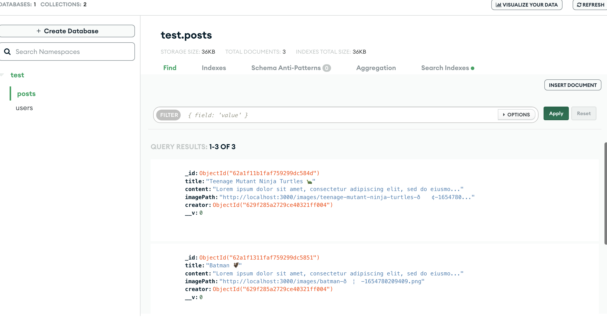

## Photo Blog 🦚
MEAN Stack Application for Photo Blogging.

## Deployed At
Deployed using AWS EC2 instance (t2.micro) running pm2. 
No more available as it regularly came very close to crossing the free-tier mark. 

## Description
Users can signup and post their favourite photos for the world to see after logging in. They can edit and delete their own posts as well. 

## Overview
<table>
  <tr>
    <td></td>
    <td></td>
  </tr>
</table>

## Screenshot
### Login and Signup Error Handling

<table>
  <tr>
    <td>Unique Email needed for Signup</td>
    <td>User is informed on signing up with short password</td>
    <td>User is informed on invalid login credentials</td>
  </tr>
  <tr>
    <td>  </td>
    <td>   </td>
    <td>  </td>
  </tr>
 </table>

### Backend

<table>
  <tr>
    <td>MongoDB used in Backends</td>
  </tr>
  <tr>
    <td>   </td>
  </tr>
 </table>
  
